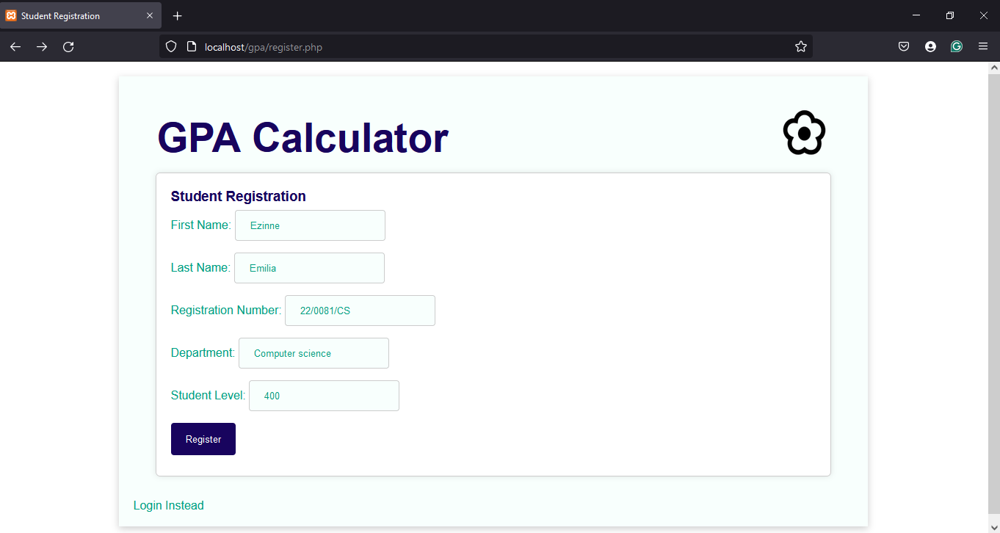

# PHP Group work - COM 411 Assignment
Each Group is made up of 20 students. The first-two names in a Group are the Team heads and assistant team heads respectively.
19 marks is awarded per student and not based on Group. Being present on the day of submission attracts you 5 marks. Your ability to explain your code and have it, execute error-free attracts you 14 marks.
This will be used to compute your practical score for com 411
Minimum requirement:
Pay N800.00 for Lab Manual
Download and Install xampp or wampserver to your PC.
Each Group is to submit their work with their PC to demonstrate their work to the Technologist.

## Group 1
Design and develop a simple GPA calculator.
This should have a login feature.

The login feature is a student’s registration number
A student with no account should be able to register with his/her firstname, lastname, registration number, department and level.

The system should be able to accept scores and grade point. This it will use to compute the GPA

**Note:** use HTML and CSS to design your frontend. Use mysql and PHP as your backend.
### What to submit
Print out of the work with the names of each member of the group in the cover page.
Create a github account and make your source code available there as well. 
The link of your work on Github should be in the second page of your print out.
